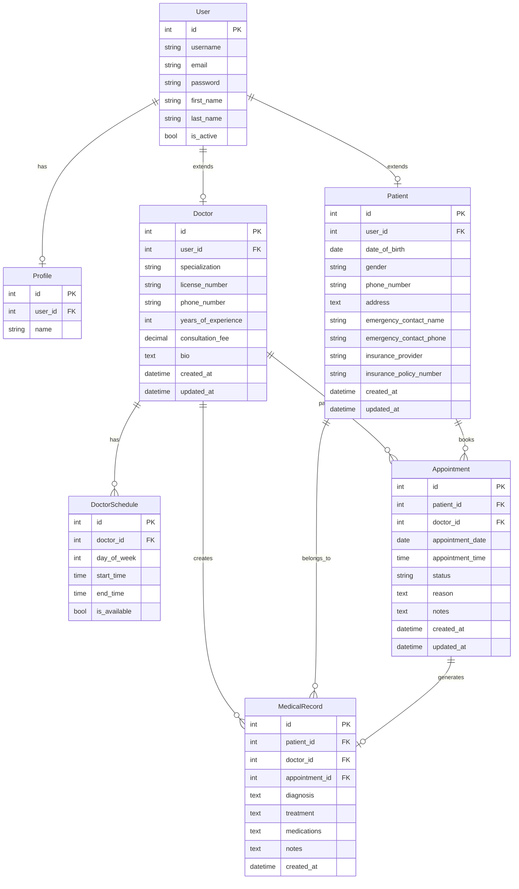
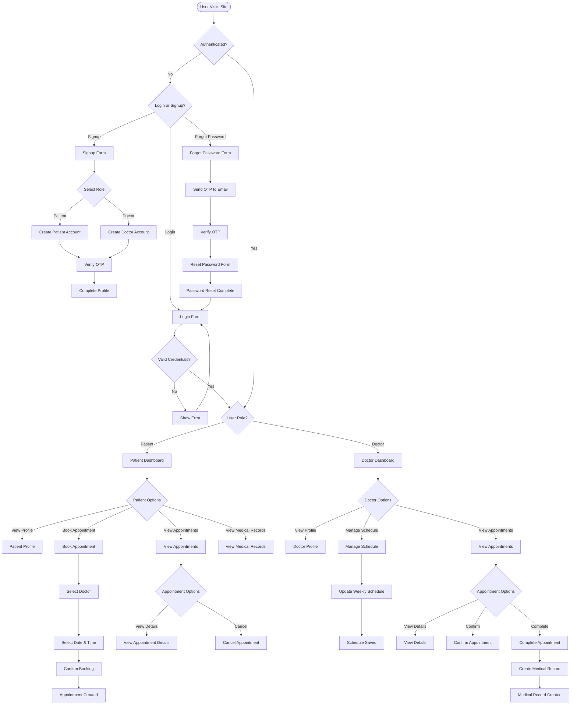

# Healthcare Management System

> **Note**: The user interface components and majority of the test suites in this project were developed with the assistance of Claude AI.

A comprehensive healthcare management system for managing patients, doctors, appointments, and medical records.

## Features

- **Patient Management**: Register and manage patient profiles, store basic patient information and contact details, and track patient identification and insurance information.
- **Doctor Management**: Maintain doctor profiles with specializations and manage doctor availability schedules.
- **Appointment Scheduling**: Create appointments between patients and doctors, check doctor availability when scheduling, prevent scheduling conflicts and double-bookings, and manage appointment status changes.
- **User Interface**: Minimal frontend with Django templates to demonstrate and test the core backend functionalities.

## Architecture

### System Architecture

The system follows a modular architecture with clear separation of concerns, illustrated through detailed Entity Relationship and System Flow diagrams:

#### Entity Relationship Diagram

The following diagram shows the complete data model and relationships between system entities:



#### System Flow Diagram

The following diagram illustrates the main user flows and system processes:



#### Backend Structure

The system follows a modular architecture with clear separation of concerns:

```
healthcare/
├── appointments/     # Appointment management
├── authenticator/    # Authentication and user management
├── doctors/          # Doctor profiles and schedules
├── patients/         # Patient profiles and medical records
├── healthcare/       # Core project settings and configuration
└── templates/        # Frontend templates
```

#### Key Components

1. **API Layer**: RESTful API endpoints for all core functionalities
2. **Service Layer**: Business logic for each domain
3. **Data Access Layer**: Models and database interactions
4. **Caching Layer**: Redis for performance optimization
5. **Asynchronous Processing**: Celery with Redis as broker

### Sequence Diagrams

#### Appointment Booking Process

```
Patient -> API: Book Appointment Request
API -> Validation: Validate Request
Validation -> Doctor Schedule: Check Availability
Doctor Schedule -> Validation: Return Available Slots
Validation -> Appointment: Create Appointment
Appointment -> Cache: Invalidate Related Caches
Appointment -> Message Queue: Schedule Notifications
API -> Patient: Return Appointment Details
Message Queue -> Doctor: Send Notification
Message Queue -> Patient: Send Confirmation
```

## API Design

The API follows RESTful principles with the following endpoints:

### Patient Endpoints

- `GET /api/v1/patients/` - List all patients (doctors only)
- `POST /api/v1/patients/` - Create a new patient
- `GET /api/v1/patients/{id}/` - Get patient details
- `PUT /api/v1/patients/{id}/` - Update patient details
- `DELETE /api/v1/patients/{id}/` - Delete a patient
- `GET /api/v1/patients/{id}/medical-records/` - Get patient's medical records

### Doctor Endpoints

- `GET /api/v1/doctors/` - List all doctors
- `POST /api/v1/doctors/` - Create a new doctor
- `GET /api/v1/doctors/{id}/` - Get doctor details
- `PUT /api/v1/doctors/{id}/` - Update doctor details
- `DELETE /api/v1/doctors/{id}/` - Delete a doctor
- `GET /api/v1/doctors/{id}/schedules/` - Get doctor's schedules
- `GET /api/v1/doctors/{id}/appointments/` - Get doctor's appointments
- `GET /api/v1/doctors/{id}/available-slots/` - Get doctor's available slots

### Appointment Endpoints

- `GET /api/v1/appointments/` - List user's appointments
- `POST /api/v1/appointments/` - Create a new appointment
- `GET /api/v1/appointments/{id}/` - Get appointment details
- `PUT /api/v1/appointments/{id}/` - Update appointment details
- `DELETE /api/v1/appointments/{id}/` - Delete an appointment
- `POST /api/v1/appointments/{id}/confirm/` - Confirm an appointment
- `POST /api/v1/appointments/{id}/complete/` - Complete an appointment
- `POST /api/v1/appointments/{id}/cancel/` - Cancel an appointment
- `GET /api/v1/appointments/upcoming/` - Get upcoming appointments
- `GET /api/v1/appointments/past/` - Get past appointments
- `GET /api/v1/appointments/today/` - Get today's appointments
- `GET /api/v1/appointments/analytics/` - Get appointment analytics

### Medical Record Endpoints

- `GET /api/v1/medical-records/` - List user's medical records
- `POST /api/v1/medical-records/` - Create a new medical record
- `GET /api/v1/medical-records/{id}/` - Get medical record details
- `PUT /api/v1/medical-records/{id}/` - Update medical record details
- `DELETE /api/v1/medical-records/{id}/` - Delete a medical record

### Authentication Endpoints

- `POST /api/v1/auth/token/` - Get OAuth2 token
- `POST /api/v1/auth/revoke-token/` - Revoke OAuth2 token
- `POST /api/v1/auth/convert-token/` - Convert token


## Security Implementation

### Authentication and Authorization

- **OAuth 2.0**: Used for secure API authentication
- **JWT Tokens**: For stateless authentication
- **Role-Based Access Control**: Different permissions for patients, doctors, and admins
- **Scope-Based Permissions**: Fine-grained control over resource access

### Data Protection

- **Sensitive Data Encryption**: For medical records and personal information
- **HTTPS**: All API communications are secured with TLS
- **Input Validation**: Comprehensive validation to prevent injection attacks
- **CSRF Protection**: For web forms and API endpoints

## Performance Optimizations

### Caching Strategy

- **Redis Cache**: For frequently accessed data
- **Cache Invalidation**: Smart invalidation based on data changes
- **Cached Queries**: Doctor schedules, patient profiles, and appointment slots

### Asynchronous Processing

- **Celery Tasks**: For background processing
- **Message Queuing**: Using Redis as broker
- **Scheduled Tasks**: For appointment reminders and status updates
- **Event-Driven Architecture**: For notifications and analytics

### Database Optimizations

- **Indexing**: On frequently queried fields
- **Query Optimization**: Efficient queries with select_related and prefetch_related
- **Connection Pooling**: For efficient database connections

## Getting Started

### Prerequisites

- Python 3.8+
- Redis
- PostgreSQL (optional, SQLite for development)

### Installation

1. Clone the repository:
   ```
   git clone https://github.com/peter-abel/healthcare.git
   cd healthcare
   ```

2. Create a virtual environment:
   ```
   python -m venv venv
   source venv/bin/activate  # On Windows: venv\Scripts\activate
   ```

3. Install dependencies:
   ```
   pip install -r requirements.txt
   ```

4. Apply migrations:
   ```
   python manage.py migrate
   ```

5. Create a superuser:
   ```
   python manage.py createsuperuser
   ```

6. Start the development server:
   ```
   python manage.py runserver
   ```

7. Start Celery worker:
   ```
   celery -A healthcare worker -l info
   ```


### API Documentation

API documentation not completed.


